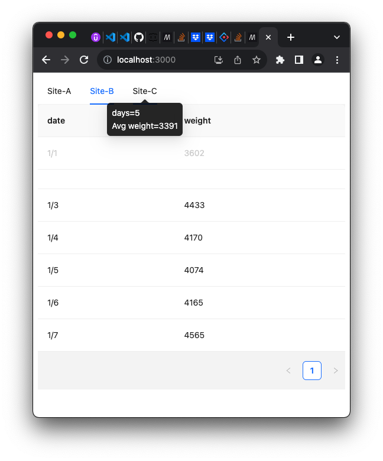

# Site Data Viewer

## Running the App

In the project directory, please run the following two commands to see the running application:
### `npm install`
Installs the neccessary dependencies.

### `npm start`
Runs the app in the development mode.\
Open [http://localhost:3000](http://localhost:3000) to view it in your browser.
